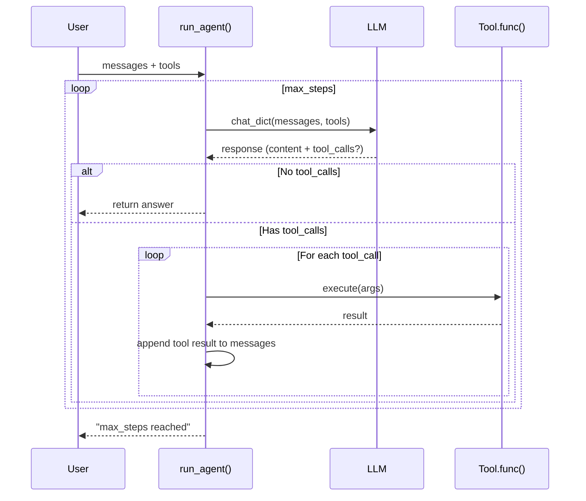

# Agent Layer Design

## 1. 职责 (Responsibilities)

本模块提供 **Agentic RAG** 能力，实现 LLM + 工具调用的 ReAct 循环。

**核心目标：**
- **工具调用**: 支持 LLM 调用外部工具 (如 RAG 检索)
- **ReAct 循环**: 思考 -> 行动 -> 观察 -> 思考 的迭代模式
- **执行追踪**: 完整记录每一步的思考和工具调用
- **灵活集成**: 可自定义工具，轻松扩展

## 2. 模块结构

```text
agent/
├── tool.py                     # Tool 数据类定义
├── executor.py                 # run_agent() 主执行函数
├── retrieval_tool.py           # 预置的 RAG 检索工具
└── __init__.py
```

## 3. 核心组件

### 3.1 Tool

工具定义：

```python
@dataclass
class Tool:
    name: str                               # 工具名称
    description: str                        # 工具描述 (给 LLM 看)
    func: Callable[..., Awaitable[Any]]     # 异步执行函数
    parameters: dict[str, Any]              # JSON Schema 参数定义
```

### 3.2 Executor 数据类型

```python
@dataclass
class ToolCall:
    """单次工具调用记录"""
    name: str
    arguments: dict
    result: str
    error: str | None = None
    elapsed_ms: float = 0.0

@dataclass
class AgentStep:
    """单步执行记录 (LLM 调用 + 工具执行)"""
    step: int
    thought: str | None = None      # LLM 的思考内容
    tool_calls: list[ToolCall]
    elapsed_ms: float = 0.0

@dataclass
class AgentResult:
    """完整执行结果"""
    answer: str                     # 最终答案
    steps: list[AgentStep]          # 执行轨迹
    total_steps: int
    total_tool_calls: int
    total_elapsed_ms: float
    finished_reason: str            # "complete" | "max_steps" | "error"
```

### 3.3 run_agent()

主执行函数：

```python
async def run_agent(
    llm: BaseLLM,
    tools: list[Tool],
    messages: list[dict],
    max_steps: int = 5,
    system_prompt: str | None = None,
    return_trace: bool = False,
) -> str | AgentResult:
    """
    运行 ReAct Agent 循环。

    Args:
        llm: 支持 tool calling 的 LLM
        tools: 可用工具列表
        messages: 对话历史 (不含 system)
        max_steps: 最大迭代步数
        system_prompt: 自定义系统提示
        return_trace: 是否返回完整执行轨迹

    Returns:
        return_trace=False: 返回最终答案字符串
        return_trace=True: 返回 AgentResult 含完整轨迹
    """
```

## 4. 执行流程



## 5. 预置工具

### 5.1 create_retrieval_tool()

创建 RAG 检索工具：

```python
from langrag.agent import create_retrieval_tool

retrieval_tool = create_retrieval_tool(
    vector_stores=[my_vector_store],
    top_k=5,
    embedder=my_embedder,
    reranker=my_reranker,          # 可选
    rewriter=my_rewriter,          # 可选
    router=my_router,              # 可选
    datasets=[dataset1, dataset2], # 可选
    tool_name="search_knowledge_base",
    tool_description="Search the knowledge base for information."
)
```

### 5.2 检索工具输出格式

```text
[Query rewritten to: optimized query]

Source 1 (kb_name, score=0.923):
<document content>

Source 2 (kb_name, score=0.891):
<document content>
```

## 6. 使用示例

### 6.1 基本使用

```python
from langrag.agent import run_agent, create_retrieval_tool

# 创建检索工具
retrieval_tool = create_retrieval_tool(
    vector_stores=[my_vdb],
    embedder=my_embedder,
    top_k=5
)

# 运行 Agent
answer = await run_agent(
    llm=my_llm,
    tools=[retrieval_tool],
    messages=[{"role": "user", "content": "What is LangRAG?"}],
    max_steps=5
)

print(answer)
```

### 6.2 获取执行轨迹

```python
result = await run_agent(
    llm=my_llm,
    tools=[retrieval_tool],
    messages=[{"role": "user", "content": "What is LangRAG?"}],
    return_trace=True
)

print(f"Answer: {result.answer}")
print(f"Steps: {result.total_steps}")
print(f"Tool Calls: {result.total_tool_calls}")
print(f"Time: {result.total_elapsed_ms:.2f}ms")

for step in result.steps:
    print(f"Step {step.step}: {step.thought}")
    for tc in step.tool_calls:
        print(f"  Tool: {tc.name}({tc.arguments}) -> {tc.result[:100]}...")
```

### 6.3 自定义工具

```python
from langrag.agent import Tool, run_agent

async def calculate(expression: str) -> str:
    """计算数学表达式"""
    try:
        result = eval(expression)  # 注意：生产环境需要安全评估
        return str(result)
    except Exception as e:
        return f"Error: {e}"

calculator_tool = Tool(
    name="calculator",
    description="Calculate mathematical expressions",
    func=calculate,
    parameters={
        "type": "object",
        "properties": {
            "expression": {
                "type": "string",
                "description": "Mathematical expression to evaluate"
            }
        },
        "required": ["expression"]
    }
)

# 使用多个工具
answer = await run_agent(
    llm=my_llm,
    tools=[retrieval_tool, calculator_tool],
    messages=[{"role": "user", "content": "What is 2+2 and what is LangRAG?"}]
)
```

### 6.4 自定义系统提示

```python
custom_prompt = """You are a helpful assistant specializing in technical documentation.
When answering questions:
1. Always use the search tool to find relevant information
2. Cite your sources
3. Be concise and accurate
"""

answer = await run_agent(
    llm=my_llm,
    tools=[retrieval_tool],
    messages=[{"role": "user", "content": "How to configure LangRAG?"}],
    system_prompt=custom_prompt
)
```

## 7. LLM 要求

Agent 需要 LLM 支持 Tool Calling (Function Calling)：

### 7.1 必需方法

```python
class BaseLLM:
    def chat_dict(self, messages: list[dict], tools: list[dict] = None, **kwargs) -> dict:
        """
        返回完整消息字典，包含 tool_calls。

        Returns:
            {
                "role": "assistant",
                "content": "...",
                "tool_calls": [
                    {
                        "id": "call_xxx",
                        "function": {
                            "name": "search_knowledge_base",
                            "arguments": '{"query": "..."}'
                        }
                    }
                ]
            }
        """
```

### 7.2 兼容模式

如果 LLM 不支持 `chat_dict`，Agent 会回退到普通 `chat()` 模式（无工具调用）。

## 8. 扩展性

### 8.1 未来可扩展功能

| 功能 | 描述 | 状态 |
|------|------|------|
| Streaming | 流式输出 Agent 思考过程 | 待实现 |
| Parallel Tool Calls | 并行执行多个工具调用 | 待实现 |
| Memory | 长期记忆支持 | 待实现 |
| Planning | 预先规划多步执行 | 待实现 |

### 8.2 添加新的预置工具

```python
# retrieval_tool.py 中添加

def create_web_search_tool(api_key: str, ...) -> Tool:
    """创建网页搜索工具"""
    async def search_web(query: str) -> str:
        # 实现网页搜索
        pass

    return Tool(
        name="web_search",
        description="Search the web for information",
        func=search_web,
        parameters={...}
    )
```

---

*Last updated: 2026-02-07*
