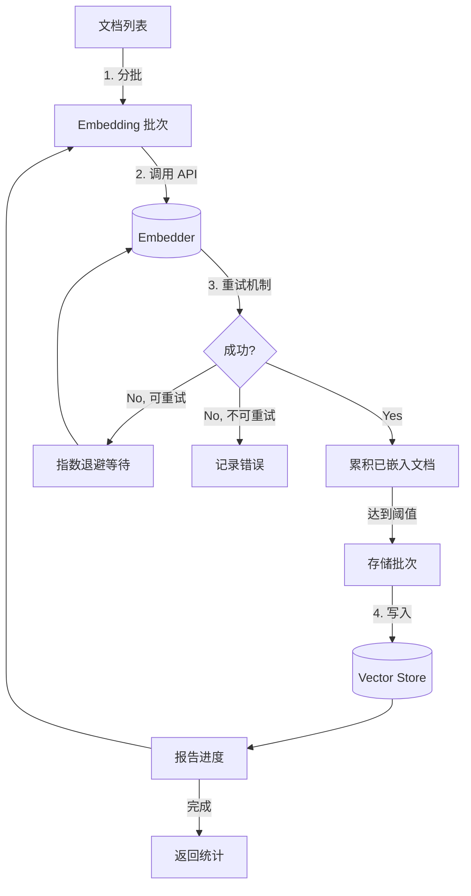

# Batch Processing Layer Design

## 1. 职责 (Responsibilities)

本模块负责 **批量文档处理**，高效处理大规模文档集合的嵌入和存储。

**核心目标：**
- **高效处理**: 批量 embedding 和存储，减少 API 调用次数
- **容错能力**: 指数退避重试，处理瞬态错误
- **进度追踪**: 实时进度回调，支持 UI 展示
- **内存友好**: 分批处理，避免内存溢出

## 2. 模块结构

```text
batch/
├── config.py                   # BatchConfig 配置类
├── processor.py                # BatchProcessor 核心处理器
├── progress.py                 # 进度追踪类型和报告器
└── __init__.py
```

## 3. 核心组件

### 3.1 BatchConfig

批处理配置类：

```python
@dataclass
class BatchConfig:
    embedding_batch_size: int = 100     # 单次 embedding API 调用的文档数
    storage_batch_size: int = 500       # 单次存储的文档数
    max_retries: int = 3                # 最大重试次数
    retry_delay: float = 1.0            # 初始重试延迟 (秒)
    retry_max_delay: float = 60.0       # 最大重试延迟
    retry_exponential_base: float = 2.0 # 指数退避基数
    retry_jitter: float = 0.1           # 随机抖动因子 (防止惊群)
    continue_on_error: bool = False     # 错误时是否继续
    show_progress: bool = True          # 是否发送进度回调
```

### 3.2 BatchProcessor

核心批处理器：

```python
class BatchProcessor:
    def __init__(
        self,
        embedder: BaseEmbedder,
        vector_store: BaseVector,
        config: BatchConfig | None = None
    ): ...

    def process_documents(
        self,
        documents: list[Document],
        on_progress: ProgressCallback | None = None
    ) -> dict[str, Any]:
        """
        处理文档列表，返回统计信息。

        Returns:
            {
                "total": 1000,
                "embedded": 995,
                "stored": 995,
                "errors": 5,
                "duration": 120.5,
                "request_id": "abc123",
                "embedding_time": 80.2,
                "storage_time": 40.3
            }
        """
```

### 3.3 Progress 类型

```python
class BatchStage(Enum):
    PARSING = "parsing"
    CHUNKING = "chunking"
    EMBEDDING = "embedding"
    STORING = "storing"
    COMPLETE = "complete"

@dataclass
class BatchProgress:
    stage: BatchStage
    current: int
    total: int
    percent: float
    message: str
    errors: int = 0
    batch_num: int = 0
    total_batches: int = 0
```

## 4. 处理流程



## 5. 使用示例

### 5.1 基本使用

```python
from langrag.batch import BatchProcessor, BatchConfig

# 创建处理器
processor = BatchProcessor(
    embedder=my_embedder,
    vector_store=my_vector_store,
    config=BatchConfig(
        embedding_batch_size=50,
        continue_on_error=True
    )
)

# 处理文档
stats = processor.process_documents(
    documents,
    on_progress=lambda p: print(f"{p.percent:.0%} - {p.message}")
)

print(f"Processed {stats['stored']}/{stats['total']} documents")
```

### 5.2 便捷函数

```python
from langrag.batch import process_in_batches, BatchConfig

stats = process_in_batches(
    embedder=my_embedder,
    vector_store=my_vector_store,
    documents=documents,
    config=BatchConfig(embedding_batch_size=100),
    on_progress=progress_callback
)
```

### 5.3 进度报告器

```python
from langrag.batch.progress import LoggingProgressReporter

# 日志报告器
reporter = LoggingProgressReporter()
processor.process_documents(documents, on_progress=reporter.report)
# Logs: "embedding: 50/100 (50.0%)"
```

## 6. 重试机制

### 6.1 指数退避

```
delay = min(
    retry_delay * (exponential_base ** attempt) + random_jitter,
    retry_max_delay
)
```

### 6.2 可重试错误

以下错误类型会触发重试：
- HTTP 429 (Rate Limit)
- HTTP 503 (Service Unavailable)
- 网络超时
- 连接错误

### 6.3 不可重试错误

以下错误直接失败：
- HTTP 401/403 (认证/授权)
- HTTP 400 (请求错误)
- 内容超长

## 7. 配置建议

### 7.1 Embedding Batch Size

| 场景 | 建议值 | 说明 |
|------|--------|------|
| OpenAI API | 100-200 | API 限制 |
| 本地模型 | 32-64 | GPU 内存限制 |
| 高延迟网络 | 50-100 | 减少超时风险 |

### 7.2 Storage Batch Size

| 场景 | 建议值 | 说明 |
|------|--------|------|
| 本地 VDB | 500-1000 | 批量插入高效 |
| 云端 VDB | 100-500 | 受网络和配额限制 |
| 内存受限 | 100-200 | 减少内存占用 |

### 7.3 不同 Embedding 模型的优化建议

#### OpenAI text-embedding-3-*

```python
config = BatchConfig(
    embedding_batch_size=100,      # OpenAI 推荐批量大小
    max_retries=5,                 # 应对 Rate Limit
    retry_delay=1.0,
    retry_max_delay=60.0,
)
```

**性能参考：**
- `text-embedding-3-small`: ~62,500 tokens/min (Tier 1)
- `text-embedding-3-large`: ~62,500 tokens/min (Tier 1)
- 建议：监控 `X-RateLimit-*` 响应头动态调整

#### 本地模型 (Ollama/vLLM)

```python
config = BatchConfig(
    embedding_batch_size=32,       # GPU 内存敏感
    storage_batch_size=500,        # 本地存储无网络开销
    max_retries=1,                 # 本地模型很少失败
)
```

**GPU 内存估算：**
- 384-dim 模型: ~1MB/100 texts
- 1536-dim 模型: ~6MB/100 texts
- 建议：`batch_size = GPU_MEM_GB * 100 / dim * 100`

#### 云端 Embedding 服务 (Azure, Cohere, etc.)

```python
config = BatchConfig(
    embedding_batch_size=50,       # 保守值，避免超时
    max_retries=3,
    retry_delay=2.0,               # 云服务可能需要更长恢复时间
    continue_on_error=True,        # 大批量处理时容错
)
```

### 7.4 大规模数据处理优化

对于 100K+ 文档的场景：

```python
# 推荐配置
config = BatchConfig(
    embedding_batch_size=100,
    storage_batch_size=1000,
    continue_on_error=True,        # 不因单个失败中断
    show_progress=True,
)

# 分段处理，定期保存进度
CHUNK_SIZE = 10000
for i in range(0, len(documents), CHUNK_SIZE):
    chunk = documents[i:i+CHUNK_SIZE]
    stats = processor.process_documents(chunk)
    save_checkpoint(i + len(chunk), stats)
```

### 7.5 内存优化

对于内存受限环境：

```python
config = BatchConfig(
    embedding_batch_size=50,       # 减少内存峰值
    storage_batch_size=100,        # 及时释放已处理文档
)

# 使用生成器避免一次性加载所有文档
def document_generator():
    for file_path in file_paths:
        yield parse_document(file_path)

# 分批处理
for batch in batched(document_generator(), 1000):
    processor.process_documents(list(batch))
```

## 8. 扩展性

### 8.1 Async 支持 (待实现)

当前 BatchProcessor 是同步的，未来可添加异步版本：

```python
async def process_documents_async(
    self,
    documents: list[Document],
    on_progress: ProgressCallback | None = None
) -> dict[str, Any]:
    """Async version with concurrent embedding."""
    pass
```

### 8.2 并行 Embedding

```python
# 未来可能的并行实现
async def _embed_batches_concurrent(
    self,
    batches: list[list[Document]],
    max_concurrent: int = 3
) -> list[list[Document]]:
    """Embed multiple batches concurrently."""
    pass
```

---

*Last updated: 2026-02-07*
