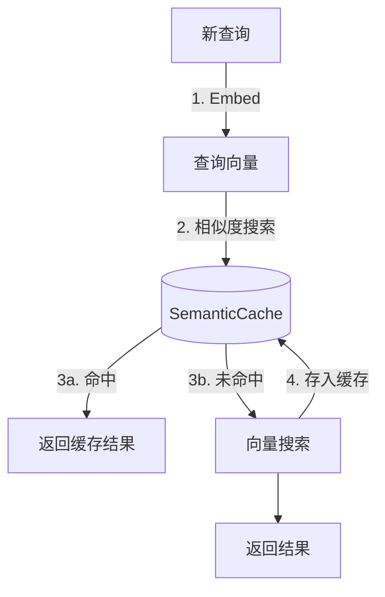

# Cache Layer Design

## 1. 职责 (Responsibilities)

本模块负责 **缓存管理**，用于缓存查询结果以避免重复的 Embedding 计算和向量搜索操作。

**核心目标：**
- **性能优化**: 减少对 LLM/Embedding API 的重复调用
- **成本节约**: 降低 Token 消耗和 API 费用
- **语义匹配**: 支持基于向量相似度的缓存命中，而非精确匹配

## 2. 模块结构

```text
cache/
├── base.py                     # BaseCache 基类, CacheEntry 数据类
├── semantic.py                 # SemanticCache 语义缓存实现
└── __init__.py
```

## 3. 核心概念

### 3.1 CacheEntry

缓存条目的数据结构：

```python
@dataclass
class CacheEntry:
    query: str                  # 原始查询文本
    embedding: list[float]      # 查询的向量表示
    results: list[Any]          # 缓存的搜索结果
    metadata: dict[str, Any]    # 元数据 (search_type, kb_id 等)
    created_at: float           # Unix 时间戳
```

### 3.2 BaseCache

抽象基类定义缓存接口：

```python
class BaseCache(ABC):
    @abstractmethod
    def get(self, key: str) -> CacheEntry | None: ...

    @abstractmethod
    def set(self, key: str, entry: CacheEntry) -> None: ...

    @abstractmethod
    def delete(self, key: str) -> None: ...

    @abstractmethod
    def clear(self) -> None: ...

    @property
    @abstractmethod
    def size(self) -> int: ...
```

## 4. SemanticCache 实现

语义缓存是本模块的核心实现，基于向量相似度进行缓存匹配。

### 4.1 工作原理



### 4.2 关键特性

| 特性 | 描述 | 默认值 |
|------|------|--------|
| `similarity_threshold` | 缓存命中的最小相似度 | 0.95 |
| `ttl_seconds` | 缓存条目生存时间 | 3600 (1小时) |
| `max_size` | 最大缓存条目数 | 1000 |
| LRU 驱逐 | 容量满时驱逐最久未使用的条目 | - |
| 线程安全 | 使用 RLock 保证并发安全 | - |

### 4.3 使用示例

```python
from langrag.cache import SemanticCache

# 创建缓存实例
cache = SemanticCache(
    similarity_threshold=0.95,  # 95% 相似度命中
    ttl_seconds=3600,           # 1小时过期
    max_size=1000               # 最多1000条
)

# 存入缓存
cache.set_with_embedding(
    query="什么是机器学习？",
    embedding=[0.1, 0.2, ...],
    results=[doc1, doc2],
    metadata={"kb_id": "kb_001"}
)

# 语义查询
hit = cache.get_by_similarity(
    embedding=[0.11, 0.19, ...],  # 相似但不完全相同
    context_key="kb_001"
)

if hit:
    print(f"缓存命中: {hit.query}")
    return hit.results

# 查看统计
print(cache.stats)
# {"hits": 100, "misses": 20, "hit_rate": 0.833, "size": 50}
```

### 4.4 相似度计算

使用余弦相似度 (Cosine Similarity) 匹配向量：

```python
similarity = cosine_similarity(query_embedding, cached_embedding)
if similarity >= threshold:
    return cached_entry
```

**性能优化：**
- 优先使用 NumPy 加速 (~100x 性能提升)
- 自动回退到纯 Python 实现（无依赖）

## 5. 配置建议

### 5.1 Similarity Threshold

| 场景 | 建议值 | 说明 |
|------|--------|------|
| 严格匹配 | 0.98+ | 几乎相同的查询才命中 |
| 标准场景 | 0.95 | 平衡准确率和命中率 |
| 宽松匹配 | 0.90 | 更多语义变体可命中 |

### 5.2 TTL 设置

| 场景 | 建议值 | 说明 |
|------|--------|------|
| 静态知识库 | 86400+ (1天+) | 内容不常变化 |
| 动态知识库 | 3600 (1小时) | 平衡新鲜度和性能 |
| 实时数据 | 300 (5分钟) | 频繁更新的数据 |

## 6. 扩展性

### 6.1 可能的扩展

- **分布式缓存**: 使用 Redis 作为后端存储
- **持久化**: 支持缓存持久化到磁盘
- **预热**: 启动时加载热门查询
- **分区**: 按 kb_id 分区存储

### 6.2 实现新的缓存后端

```python
class RedisSemanticCache(BaseCache):
    """Redis-backed semantic cache for distributed deployments."""

    def __init__(self, redis_url: str, **kwargs):
        self.redis = redis.from_url(redis_url)
        # ...

    def get(self, key: str) -> CacheEntry | None:
        data = self.redis.get(key)
        if data:
            return CacheEntry(**json.loads(data))
        return None
```

---

*Last updated: 2026-02-07*
