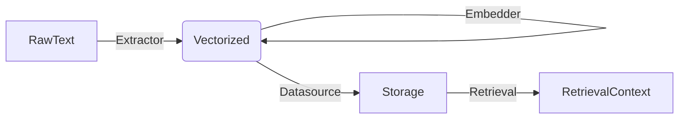

# Entities Layer Design

## 1. 职责 (Responsibilities)

本模块定义了 LangRAG 系统中流转的核心领域对象（Domain Objects）。它是系统内部通信的通用语言（Ubiquitous Language），确保各个层级（Indexing, Retrieval, Datasource）之间的数据交互标准统一，降低耦合度。

核心目标：
- **标准化数据契约**：无论底层使用的是 Chroma 还是 ElasticSearch，上层业务逻辑看到的永远是统一的 `Document` 对象。
- **元数据规范**：定义系统中必须存在的元数据字段（如 `doc_id`, `dataset_id`），确保数据可追踪、可更新。
- **类型安全**：使用 Pydantic 进行运行时类型校验。

## 2. 核心实体设计

### 2.1 Chunk / Document (`Document`)

系统中最基础的数据单元。在 LangRAG 中，我们统一使用 `Document` 类来表示“切片(Chunk)”和“原文档(Source Document)”。

**设计决策说明**：我们没有单独定义 `Chunk` 类，而是通过 `Document` 的 metadata 来区分。这是为了简化接口，因为在向量库中，它们本质上都是一段带向量的文本。

```python
class Document(BaseModel):
    """
    Represents a source document OR a chunk in the RAG system.
    """
    # [核心内容]
    # page_content: 文本内容，必需，不能为空。
    page_content: str = Field(..., min_length=1)
    
    # [向量表示]
    # vector: 该文本对应的 Embedding 向量。
    # Optional: 在 Indexing 的 Embedding 阶段前，此字段为 None。
    vector: list[float] | None = Field(default=None)
    
    # [唯一标识]
    # id: 该对象的唯一 ID (UUID)。
    # 对于 Chunk，这是 Chunk ID；对于原文档，这是 File ID。
    id: str = Field(default_factory=lambda: str(uuid4()))
    
    # [元数据]
    # 存储所有非结构化或半结构化信息。
    metadata: dict[str, Any] = Field(default_factory=dict)
```

**Metadata 规范 (Standard Metadata Fields)**:
为了保证系统各模块能正确处理数据，我们约定以下 Key 为保留字段：

| Key | 类型 | 说明 | 必填 |
| :--- | :--- | :--- | :--- |
| `dataset_id` | str | 该数据归属的知识库 ID | ✅ |
| `document_id` | str | 归属的源文件 ID (Parent ID) | ✅ (对于 Chunk) |
| `doc_id` | str | 自身的业务 ID (通常等于 `id`) | ⚠️ (兼容性保留) |
| `doc_hash` | str | 内容哈希，用于幂等写入和去重 | ❌ |
| `position` | int | 在原文中的切片序号 (1-based) | ❌ |
| `score` | float | 检索时的相似度得分 (仅在 Retrieval 阶段存在) | ❌ |

### 2.2 Dataset (知识库)

代表一个逻辑上的文档集合，是用户管理数据的最小单元。

```python
class Dataset(BaseModel):
    id: str
    name: str
    description: str | None = None
    
    # [配置]
    # indexing_technique: 索引策略
    # - "high_quality": 使用 Embedding 模型进行语义索引
    # - "economy": 使用 Keyword/倒排索引 (无需 Embedding 消耗)
    indexing_technique: str = "high_quality"
    
    # [绑定]
    # collection_name: 该 Dataset 在底层向量库中对应的表名/集合名
    # LangRAG 支持多 Dataset 共享一个 Collection (通过 filtering)，也支持独占。
    collection_name: str
    
    # [租户信息]
    tenant_id: str | None = None
```

### 2.3 RetrievalContext (检索上下文)

当检索完成后，返回给 LLM 生成层的封装对象。相比简单的 `Document`，它包含了检索过程中的元信息（如得分）。

```python
class RetrievalContext(BaseModel):
    document_id: str
    content: str
    score: float
    
    # 原始文档的完整元数据
    metadata: dict[str, Any]
    
    # 来源标记 (便于调试是一路召回还是二路重排)
    # e.g., "vector", "keyword", "reranked"
    retrieval_method: str | None = None
```

## 3. 数据流转图



## 4. 扩展性考虑

未来可能引入 **多模态 (Multimodal)** 支持。
届时 `Document` 对象可能需要扩展字段：
- `images: list[str]` (base64 或 url)
- `modality: str` ("text", "image", "audio")

目前的 `page_content` 字段在多模态下可能存储的是对图片的描述（Caption），或者 OCR 结果。

