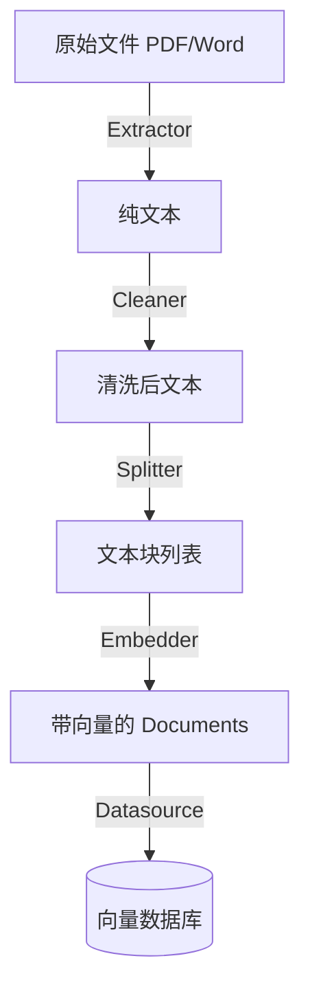

# Index Processor Layer Design

## 1. 职责 (Responsibilities)

本模块负责 **索引构建工作流 (Indexing Pipeline)**，即 ETL (Extract, Transform, Load) 过程。
它负责将原始的非结构化数据转化为数据库可存储、检索可用的向量索引。

**核心目标：**
- **高质量切分**：切分策略直接决定了检索的准确率。
- **数据清洗**：剔除无意义字符，提高 Embedding 的信噪比。
- **灵活性**：支持多种索引模式（普通段落索引、父子索引、QA 索引、RAPTOR 等）。

## 2. 模块结构

```text
index_processor/
├── extractor/                  # [Extract] 提取器
│   ├── base.py                 # BaseParser 基类
│   ├── factory.py              # ParserFactory 工厂
│   └── providers/              # 具体解析器实现
│       ├── pdf.py              # PDF 解析 (PyMuPDF)
│       ├── docx.py             # Word 文档解析
│       ├── html.py             # HTML 解析
│       ├── markdown.py         # Markdown 解析
│       └── simple_text.py      # 纯文本解析
├── cleaner/                    # [Clean] 清洗器
│   └── cleaner.py              # 规则清洗 (正则、去重)
├── splitter/                   # [Transform] 切分器
│   ├── base.py                 # BaseChunker 基类
│   ├── factory.py              # ChunkerFactory 工厂
│   └── providers/
│       ├── fixed_size.py       # 固定大小切分
│       └── recursive_character.py  # 递归字符切分
└── processor/                  # [Load & Orchestrate] 索引编排器
    ├── base.py                 # BaseIndexProcessor 基类
    ├── paragraph.py            # 普通段落索引
    ├── parent_child.py         # 父子索引 (已实现)
    ├── qa.py                   # QA 索引 (已实现)
    └── raptor.py               # RAPTOR 树形索引 (已实现)
```

## 3. ETL 流程详解

一个标准的索引流程如下：



### 3.1 Extractor (提取)
负责将二进制文件或特定格式转为纯文本。
- **输入**: File Path / Binary Stream
- **输出**: `list[Document]` (通常每个 Page 一个 Document)

### 3.2 Cleaner (清洗)
负责提高数据质量。
- **规则**:
    - 替换连续空格/换行 (`\n\n+` -> `\n`)
    - 去除不可见字符 (`\x00` 等)
    - (Optional) 去除页眉页脚干扰词

### 3.3 Splitter (切分)
这是最关键的步骤。
- **RecursiveCharacterSplitter**: 优先按段落切，再按句子切，最后按字符切。保证语义尽可能完整。
- **FixedSizeSplitter**: 硬切，适用于 Token 限制极其严格场景。

### 3.4 Processor (索引策略)

LangRAG 支持多种策略类，主要的策略有：

#### A. Paragraph Indexing (基础模式)
最通用的 RAG 模式。实现于 `processor/paragraph.py`。
1. 将文档直接切分为 500-1000 token 的 Chunk。
2. 为每个 Chunk 计算 Embedding。
3. 存入 VDB。
4. **优点**: 简单高效。
5. **缺点**: 粒度大的 Chunk 包含噪音多，粒度小的 Chunk 丢失上下文。

#### B. Parent-Child Indexing (进阶模式) ✅ 已实现
解决粒度矛盾的高级策略。实现于 `processor/parent_child.py`。
1. **Parent Chunking**: 将文档切分为较大的块 (e.g. 2000 tokens)。
2. **Child Chunking**: 将每个 Parent 再切分为多个小块 (e.g. 400 tokens)。
3. **Indexing**:
   - 对 Child 进行 Embedding，存入 VDB，用于**检索**。
   - 将 Parent 存入 DocStore (KV Store)，用于**生成**。
4. **Retrieval**: 检索命中 Child 时，通过 ID 映射找到其对应的 Parent，将 Parent 的内容作为 Context 给 LLM。
5. **优点**: 检索精准（Child 语义单一），上下文丰富（Parent 内容完整）。

#### C. QA Indexing ✅ 已实现
使用 LLM 生成问题的索引策略。实现于 `processor/qa.py`。
1. 将文档切分为 Chunk。
2. 使用 LLM 为每个 Chunk 生成 1-N 个 potential questions。
3. 对生成的 Q 进行 Embedding 存入 VDB。
4. 检索时，用户问题与 Q 向量匹配，返回对应的 Chunk (A) 内容。
5. **优点**: 更好的语义匹配（问题对问题）。
6. **缺点**: 需要 LLM 调用，索引成本较高。

#### D. RAPTOR Indexing ✅ 已实现
递归抽象处理的树形索引。实现于 `processor/raptor.py`。
基于论文 [RAPTOR: Recursive Abstractive Processing for Tree-Organized Retrieval](https://arxiv.org/abs/2401.18059)。
1. 将文档切分为 Leaf Chunks。
2. 使用 GMM 聚类对相似 Chunks 分组。
3. 使用 LLM 对每个聚类生成摘要，作为 Parent Node。
4. 递归向上构建，形成树形结构。
5. **优点**: 多层次理解，适合复杂长文档。
6. **缺点**: 需要多次 LLM 调用，构建成本高。

## 4. 关键实现细节

### 4.1 幂等性与去重
在 `Processor` 层面处理。
- 计算 `doc_hash` (MD5 of content)。
- 入库前检查 VDB 中是否存在相同 hash 的 Chunk。
- 如果存在，跳过 Embedding 计算（节省 Token 费用）。

### 4.2 错误处理
- 单个文件的解析失败不应中断整个 Batch 的索引。
- 失败的 Documents 应被记录到 `indexing_errors` 列表返回给调用方。

## 5. 扩展性

新增索引策略只需：
1. 在 `processor/` 下创建新的 Processor 类，继承 `BaseIndexProcessor`
2. 实现 `process(dataset: str, documents: list[Document])` 方法
3. 在 `__init__.py` 中导出

### 5.1 未来可扩展的策略

- **Semantic Chunking**: 基于语义边界切分，而非固定字符/Token。
- **Graph Indexing**: 构建知识图谱索引，支持实体关系检索。
- **Multi-Modal Indexing**: 支持图片、表格等多模态内容索引。

### 5.2 Async 支持 (待实现)

当前 Processor 仅支持同步 `process()` 方法。对于需要异步调用的场景（如 Plugin IPC），
建议后续添加 `process_async()` 方法。

```python
# 建议添加到 BaseIndexProcessor
async def process_async(self, dataset: str, documents: list[Document]) -> None:
    """Async version of process for async-first consumers."""
    raise NotImplementedError("Async processing not implemented")
```

