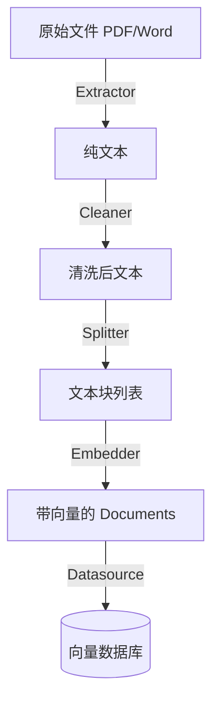

# Index Processor Layer Design

## 1. 职责 (Responsibilities)

本模块负责 **索引构建工作流 (Indexing Pipeline)**，即 ETL (Extract, Transform, Load) 过程。
它负责将原始的非结构化数据转化为数据库可存储、检索可用的向量索引。

**核心目标：**
- **高质量切分**：切分策略直接决定了检索的准确率。
- **数据清洗**：剔除无意义字符，提高 Embedding 的信噪比。
- **灵活性**：支持多种索引模式（如普通段落索引、父子索引、QA 索引）。

## 2. 模块结构

```text
index_processor/
├── extractor/           # [Extract] 提取器
│   ├── base.py
│   ├── pdf_extractor.py
│   ├── html_extractor.py
│   └── ...
├── cleaner/             # [Clean] 清洗器
│   └── cleaner.py       # 规则清洗 (正则、去重)
├── splitter/            # [Transform] 切分器
│   ├── base.py
│   ├── character.py     #按字符数硬切
│   └── recursive.py     # 递归切分 (LangChain style)
└── processor/           # [Load & Orchestrate] 索引编排器
    ├── base.py
    ├── paragraph.py     # 普通段落索引逻辑
    └── parent_child.py  # (Planned) 父子索引逻辑
```

## 3. ETL 流程详解

一个标准的索引流程如下：



### 3.1 Extractor (提取)
负责将二进制文件或特定格式转为纯文本。
- **输入**: File Path / Binary Stream
- **输出**: `list[Document]` (通常每个 Page 一个 Document)

### 3.2 Cleaner (清洗)
负责提高数据质量。
- **规则**:
    - 替换连续空格/换行 (`\n\n+` -> `\n`)
    - 去除不可见字符 (`\x00` 等)
    - (Optional) 去除页眉页脚干扰词

### 3.3 Splitter (切分)
这是最关键的步骤。
- **RecursiveCharacterSplitter**: 优先按段落切，再按句子切，最后按字符切。保证语义尽可能完整。
- **FixedSizeSplitter**: 硬切，适用于 Token 限制极其严格场景。

### 3.4 Processor (索引策略)

LangRAG 支持多种策略类，主要的策略有：

#### A. Paragraph Indexing (基础模式)
最通用的 RAG 模式。
1. 将文档直接切分为 500-1000 token 的 Chunk。
2. 为每个 Chunk 计算 Embedding。
3. 存入 VDB。
4. **优点**: 简单高效。
5. **缺点**: 粒度大的 Chunk 包含噪音多，粒度小的 Chunk 丢失上下文。

#### B. Parent-Child Indexing (进阶模式)
解决粒度矛盾的高级策略。
1. **Parent Chunking**: 将文档切分为较大的块 (e.g. 2000 tokens)。
2. **Child Chunking**: 将每个 Parent 再切分为多个小块 (e.g. 400 tokens)。
3. **Indexing**: 
   - 对 Child 进行 Embedding，存入 VDB，用于**检索**。
   - 将 Parent 存入 DocStore (KV Store)，用于**生成**。
4. **Retrieval**: 检索命中 Child 时，通过 ID 映射找到其对应的 Parent，将 Parent 的内容作为 Context 给 LLM。
5. **优点**: 检索精准（Child 语义单一），上下文丰富（Parent 内容完整）。

## 4. 关键实现细节

### 4.1 幂等性与去重
在 `Processor` 层面处理。
- 计算 `doc_hash` (MD5 of content)。
- 入库前检查 VDB 中是否存在相同 hash 的 Chunk。
- 如果存在，跳过 Embedding 计算（节省 Token 费用）。

### 4.2 错误处理
- 单个文件的解析失败不应中断整个 Batch 的索引。
- 失败的 Documents 应被记录到 `indexing_errors` 列表返回给调用方。

## 5. 扩展性
- **QA Indexing**: 未来可增加 `QAProcessor`，使用 LLM 为每个 Chunk 生成 potential questions，将 Q 作为向量索引，A 作为内容返回。
