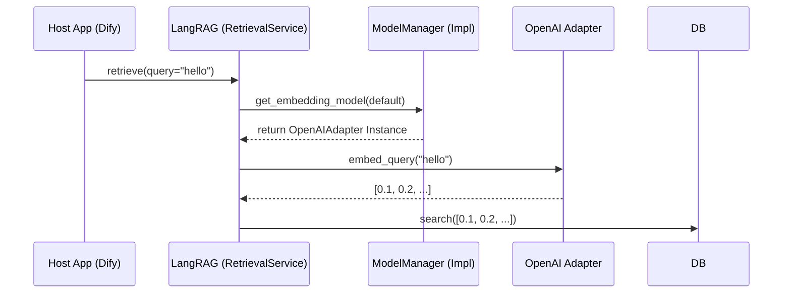

# LLM Layer Design

## 1. 职责 (Responsibilities)

本模块作为 **网关 (Gateway)** 或 **适配器 (Adapter)**，封装了所有对大语言模型（LLM）能力的调用。
LangRAG 自身不包含任何具体的模型实现逻辑（如 OpenAI SDK 调用），而是定义了一套标准接口，要求宿主程序（如 Dify、FastAPI App）注入符合接口的实例。

**核心目标：**
- **解耦**: LangRAG 不绑定任何特定模型供应商。
- **依赖注入**: 允许在运行时动态切换模型（例如：检索用 OpenAI，生成用 Claude）。
- **统一抽象**: 抹平不同模型 API 的参数差异。

## 2. 接口定义

### 2.1 BaseLLM
代表一个具体的模型实例。它可能是一个 Embedding 模型，或者一个 Chat 模型，或者两者兼具。

```python
class BaseLLM(ABC):
    """
    Interface for LLM capabilities.
    """

    @abstractmethod
    def embed_documents(self, texts: list[str]) -> list[list[float]]:
        """
        [Embedding Only]
        批量将文本转换为向量。用于 Indexing 阶段。
        Asserts: len(output) == len(texts)
        """
        pass

    @abstractmethod
    def embed_query(self, text: str) -> list[float]:
        """
        [Embedding Only]
        将单个查询转换为向量。用于 Retrieval 阶段。
        注意：某些模型对接 Query 和 Document 使用不同的 Instruction。
        """
        pass

    @abstractmethod
    def chat(self, messages: list[dict], **kwargs) -> str:
        """
        [Chat/Generation Only]
        执行对话生成。
        Args:
            messages: 标准 OpenAI 格式 [{"role": "user", "content": "..."}]
            kwargs: temperature, max_tokens, stop, etc.
        Returns:
            生成的文本内容。
        """
        pass
```

### 2.2 ModelManager
代表模型管理的容器。LangRAG 的组件（如 Processor, Router）将持有这个 Manager，由此获取所需的具体模型。

```python
class ModelManager(ABC):
    """
    Interface for retrieving configured model instances.
    """

    @abstractmethod
    def get_embedding_model(self, model_uid: str = None) -> BaseLLM:
        """
        获取 Embedding 模型。
        :param model_uid: 指定的模型 ID。若为 None，返回系统默认模型。
        """
        pass

    @abstractmethod
    def get_chat_model(self, model_uid: str = None) -> BaseLLM:
        """
        获取 Chat/Generation 模型。
        """
        pass
    
    # 预留 Rerank 接口
    # rerank 通常模型接口差异较大，可能需要单独的 BaseReranker 定义
    # def get_rerank_model(self, ...)
```

## 3. 集成模式 (Integration Pattern)



## 4. 错误处理标准

实现 `BaseLLM` 的适配器必须遵循以下错误处理规范，以便 LangRAG 能正确响应：

1.  **Rate Limit (429)**: 应抛出特定的 `LLMRateLimitError`。LangRAG 的任务队列可能会捕获此错误并进行指数退避重试。
2.  **Context Length Exceeded**: 当 Prompt 超过模型窗口时，应抛出 `LLMContextWindowError`。 LangRAG 的生成模块可能会尝试缩减 Context 并重试。
3.  **Authentication Error**: API Key 无效，应直接 Fail。

## 5. 演进说明

- **Before**: 之前可能在代码里硬编码了 `OpenAIEmbeddings`。
- **After**: 完全依赖接口。这使得 LangRAG 可以轻松被集成到任何拥有自己模型管理系统的平台中，甚至可以用于纯本地模型（Ollama/vLLM）环境。
