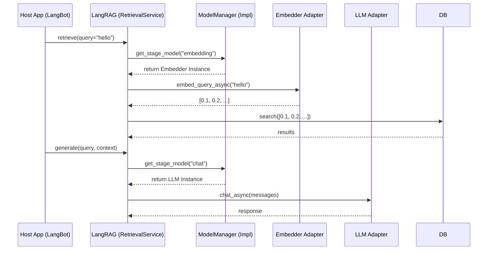

# LLM Layer Design

## 1. 职责 (Responsibilities)

本模块作为 **网关 (Gateway)** 或 **适配器 (Adapter)**，封装了所有对大语言模型（LLM）和嵌入模型的调用。
LangRAG 自身不包含任何具体的模型实现逻辑（如 OpenAI SDK 调用），而是定义了一套标准接口，要求宿主程序（如 Dify、FastAPI App、LangBot）注入符合接口的实例。

**核心目标：**
- **解耦**: LangRAG 不绑定任何特定模型供应商。
- **依赖注入**: 允许在运行时动态切换模型（例如：检索用 OpenAI，生成用 Claude）。
- **统一抽象**: 抹平不同模型 API 的参数差异。
- **Sync/Async 支持**: 同时支持同步和异步调用模式。

## 2. 模块结构

```text
llm/
├── base.py                     # BaseLLM, ModelManager 基类
├── factory.py                  # LLMFactory
├── config.py                   # LLM 配置类
├── stages.py                   # Stage 枚举和配置
├── embedder/                   # 嵌入模型子模块
│   ├── base.py                 # BaseEmbedder 基类
│   ├── factory.py              # EmbedderFactory
│   └── providers/              # 具体嵌入器实现
│       ├── mock.py             # Mock 嵌入器 (测试用)
│       └── seekdb_embedder.py  # SeekDB 嵌入器
└── providers/                  # 具体 LLM 实现
    ├── openai.py               # OpenAI 适配器
    └── local.py                # 本地模型适配器 (Ollama)
```

## 3. 接口定义

### 3.1 BaseLLM

代表一个具体的模型实例，同时具备 Embedding 和 Chat 能力。

```python
class BaseLLM(ABC):
    """
    Interface for a specific LLM instance.
    Supports both sync and async implementations.
    """

    # ========== Sync Methods ==========

    @abstractmethod
    def embed_documents(self, texts: list[str]) -> list[list[float]]:
        """Embed a list of texts (for indexing)."""
        pass

    @abstractmethod
    def embed_query(self, text: str) -> list[float]:
        """Embed a single query (for retrieval)."""
        pass

    @abstractmethod
    def chat(self, messages: list[dict], **kwargs) -> str:
        """Chat completion. Returns generated text."""
        pass

    def chat_dict(self, messages: list[dict], **kwargs) -> dict:
        """Chat completion returning full message dict (for tool calls)."""
        pass

    @abstractmethod
    def stream_chat(self, messages: list[dict], **kwargs):
        """Stream chat completion. Returns a generator yielding tokens."""
        pass

    # ========== Async Methods ==========
    # 每个 sync 方法都有对应的 async 版本，后缀 _async
    # 默认实现使用 asyncio.to_thread 包装 sync 方法

    async def embed_documents_async(self, texts: list[str]) -> list[list[float]]: ...
    async def embed_query_async(self, text: str) -> list[float]: ...
    async def chat_async(self, messages: list[dict], **kwargs) -> str: ...
    async def chat_dict_async(self, messages: list[dict], **kwargs) -> dict: ...
    async def stream_chat_async(self, messages: list[dict], **kwargs) -> AsyncIterator[str]: ...
```

### 3.2 BaseEmbedder ✅ 新增

独立的嵌入模型接口，与 BaseLLM 分离。适用于仅需 Embedding 能力的场景。

```python
class BaseEmbedder(ABC):
    """
    Abstract base class for embedding generation.
    Supports both sync and async implementations.
    """

    @abstractmethod
    def embed(self, texts: list[str]) -> list[list[float]]:
        """Generate embeddings for a list of texts (sync version)."""
        pass

    async def embed_async(self, texts: list[str]) -> list[list[float]]:
        """Generate embeddings (async version). Default wraps sync."""
        pass

    @property
    @abstractmethod
    def dimension(self) -> int:
        """Return the embedding dimension."""
        pass
```

**使用场景对比：**
- `BaseLLM`: 需要 Chat + Embedding 的场景（传统一体化模型）
- `BaseEmbedder`: 仅需 Embedding 的场景（专用嵌入模型，如 text-embedding-3-large）

### 3.3 ModelManager

模型管理器，支持按名称或按阶段获取模型。

```python
class ModelManager(ABC):
    """
    Interface for managing and retrieving LLM instances.
    Supports both simple model retrieval and stage-based configuration.
    """

    # ========== 核心方法 ==========

    @abstractmethod
    def get_model(self, name: str = None) -> BaseLLM | None:
        """Get an LLM instance by name. None returns default."""
        pass

    @abstractmethod
    def list_models(self) -> list[str]:
        """List all available model names."""
        pass

    # ========== Stage-based API ==========

    @abstractmethod
    def get_stage_model(self, stage: str) -> BaseLLM | None:
        """Get the LLM configured for a specific stage."""
        pass

    @abstractmethod
    def set_stage_model(self, stage: str, model_name: str) -> None:
        """Configure an LLM for a specific stage."""
        pass

    @abstractmethod
    def get_stage_model_name(self, stage: str) -> str | None:
        """Get the model name configured for a specific stage."""
        pass

    @abstractmethod
    def list_stages(self) -> list[str]:
        """List all available stages."""
        pass

    # ========== Legacy (Deprecated) ==========

    def get_embedding_model(self, model_uid: str = None) -> BaseLLM:
        """[DEPRECATED] Use get_model() instead."""
        pass

    def get_chat_model(self, model_uid: str = None) -> BaseLLM:
        """[DEPRECATED] Use get_stage_model('chat') instead."""
        pass
```

## 4. Stage-based 模型配置

LangRAG 支持为不同的 RAG 阶段配置不同的模型，以优化成本和效果。

### 4.1 支持的阶段

| Stage | 描述 | 典型模型 |
|-------|------|---------|
| `embedding` | 向量嵌入 | text-embedding-3-large |
| `chat` | 对话生成 | gpt-4, claude-3 |
| `router` | 意图路由 | gpt-4o-mini |
| `rewriter` | Query 重写 | gpt-4o-mini |
| `reranker` | 结果重排 | cohere-rerank, bge-reranker |
| `qa_gen` | QA 生成 | gpt-4o |
| `raptor_summary` | RAPTOR 摘要 | gpt-4o-mini |

### 4.2 使用示例

```python
# 配置不同阶段使用不同模型
manager.set_stage_model("embedding", "text-embedding-3-large")
manager.set_stage_model("chat", "gpt-4o")
manager.set_stage_model("router", "gpt-4o-mini")  # 轻量模型节省成本

# 在组件中使用
embedding_model = manager.get_stage_model("embedding")
chat_model = manager.get_stage_model("chat")
```

## 5. 集成模式 (Integration Pattern)



## 6. 错误处理标准

实现 `BaseLLM` / `BaseEmbedder` 的适配器必须遵循以下错误处理规范：

1.  **Rate Limit (429)**: 应抛出 `LLMRateLimitError`。上层可进行指数退避重试。
2.  **Context Length Exceeded**: 抛出 `LLMContextWindowError`。生成模块可能会尝试缩减 Context。
3.  **Authentication Error**: API Key 无效，直接抛出异常。
4.  **Connection Error**: 网络问题，可考虑重试。

## 7. Async-First 实现指南

对于纯异步场景（如 Plugin IPC），推荐实现方式：

```python
class AsyncOnlyEmbedder(BaseEmbedder):
    """Async-only embedder for RPC-based systems."""

    def embed(self, texts: list[str]) -> list[list[float]]:
        # 对于纯异步实现，sync 方法可以直接抛异常
        raise NotImplementedError("Use embed_async() for this embedder")

    async def embed_async(self, texts: list[str]) -> list[list[float]]:
        # 真正的实现在这里
        return await self.rpc_embed(texts)

    @property
    def dimension(self) -> int:
        return self._dimension
```

## 8. 演进说明

### 8.1 与旧版本对比

| 项目 | Before | After |
|------|--------|-------|
| Embedding | 内置在 BaseLLM | 独立的 BaseEmbedder |
| Async | 无 | 全面支持 *_async 方法 |
| Stage | 无 | Stage-based 模型配置 |
| ModelManager | 简单 get | 支持 stage/name/list |

### 8.2 迁移建议

- 使用 `get_model()` 替代 `get_embedding_model()`
- 使用 `get_stage_model("chat")` 替代 `get_chat_model()`
- 优先使用 `BaseEmbedder` 而非 `BaseLLM.embed_*` 进行嵌入

---

*Last updated: 2026-02-07*
