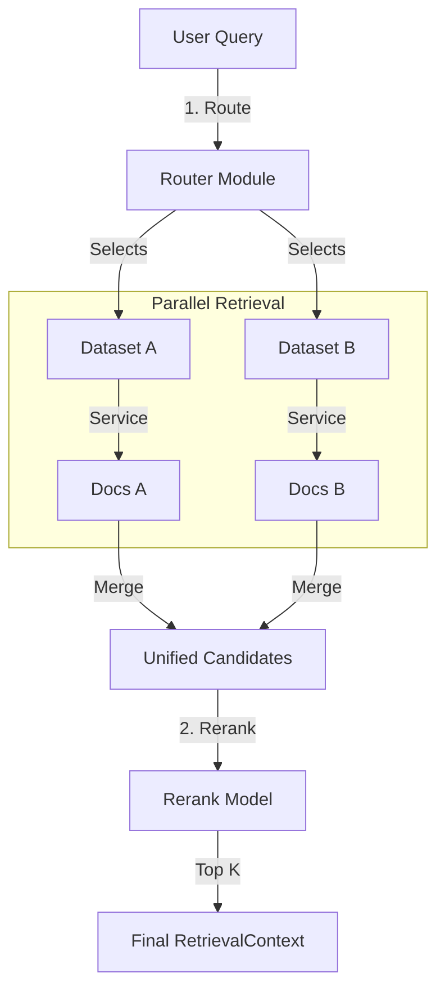

# Retrieval Layer Design

## 1. 职责 (Responsibilities)

本模块是 RAG 系统的 **业务编排层 (Orchestrator)**。
它位于 `LLM` (生成层) 和 `Datasource` (存储层) 之间，负责“找到最相关的信息”。

它的核心职责不是直接操作数据库（这是 `datasource` 的事），而是制定**检索策略**：
1.  **Routing (查哪里)**: 根据用户问题，智能决定去查询哪个或哪几个知识库。
2.  **Dispatch (怎么查)**: 并发调度底层的检索服务，可能同时触发关键词搜索和向量搜索。
3.  **Refusal (筛什么)**: 过滤低质量结果，确保上下文的信噪比。
4.  **Optimization (怎么排)**: 通过 Reranking 模型对多路召回的结果进行统一排序。

## 2. 模块结构

```text
retrieval/
├── router/             # [Agentic] 意图识别与路由
│   ├── base.py         # Router 接口
│   └── llm_router.py   # 基于 LLM 推理的路由实现
├── rerank/             # [Optimization] 重排序
│   ├── base.py         # Reranker 接口
│   └── cohere.py       # Cohere/BGE 重排模型适配
├── compressor/         # [Optional] 上下文压缩 (Summary/Extraction)
└── workflow.py         # [Facade] RetrievalWorkflow 主流程
```

## 3. 核心流程 (Retrieval Workflow)

这是调用 `langrag` 的主入口。



### 3.1 步骤详解

1.  **Routing (智能路由)**:
    - 输入: 用户 Query, 可用 Datasets 列表。
    - 输出: 选中的 Datasets 子集。
    - 逻辑: 如果只有一个 Dataset，直接通过；如果有多个，使用 LLM 分析 Query 语义，判断需要哪些领域的知识。

2.  **Dispatch (检索调度)**:
    - 对于选中的每个 Dataset，根据其配置 (`indexing_technique`) 调用 `datasource.RetrievalService`。
    - **向量模式**: 调用 `vector_search`。
    - **全文模式**: 调用 `keyword_search`。
    - **混合模式**: 调用 Hybrid 接口（或在 Service 层做 RRF）。
    - 此步骤应通过 `ThreadPoolExecutor` 并行执行。

3.  **Reranking (重排序)**:
    - 既然汇总了来自不同 Dataset、甚至不同检索方式（向量 vs 倒排）的结果，它们原始的 `cloud_score` (0.0-1.0) 往往并不具备可比性。
    - 因此，必须引入一个 **Cross-Encoder Reranker** (如 BGE-Reranker, Cohere)，重新计算 (Query, Doc) 对的相关性分数。
    - 最终根据 Rerank Score 截取 Top K。

## 4. 关键组件接口

### 4.1 BaseRouter (路由)

```python
class BaseRouter(ABC):
    @abstractmethod
    def route(self, query: str, datasets: list[Dataset]) -> list[Dataset]:
        """
        根据 Query 筛选最相关的 Datasets。
        如果无法判断或所有都相关，返回所有 Datasets。
        """
        pass
```

### 4.2 BaseReranker (重排)

```python
class BaseReranker(ABC):
    @abstractmethod
    def rerank(
        self, 
        query: str, 
        documents: list[Document], 
        top_n: int = 4
    ) -> list[Document]:
        """
        对文档列表进行重排序。
        返回列表需按相关性降序排列，且 Document.metadata['score'] 应更新为 Rerank 分数。
        """
        pass
```

### 4.3 RetrievalWorkflow (流程编排)

```python
class RetrievalWorkflow:
    def __init__(self, router: BaseRouter = None, reranker: BaseReranker = None):
        self.router = router
        self.reranker = reranker

    def retrieve(self, query: str, datasets: list[Dataset], ...) -> list[RetrievalContext]:
        # 串联 Route -> Service.retrieve -> Rerank 逻辑
        pass
```

## 5. Agentic RAG 扩展

本层是实现 Agentic RAG 的关键区域。

### 5.1 LLM Router 实现思路
- 将每个 Dataset 视为一个 **Tool**。
- `Dataset.name` 是 Tool Name，`Dataset.description` 是 Tool Description。
- 构造这样一个 Prompt 给 LLM：
    ```text
    User Query: "How to fix the login bug?"
    Available Tools:
    1. Technical_Docs: For engineering and bug fixes.
    2. HR_Policies: For leave and holiday info.
    
    Select the most relevant tools (return IDs).
    ```
- LLM 返回 `[1]`，Router 解析后只去查 `Technical_Docs`。

### 5.2 Query Rewrite (查询重写)
在 `Workflow` 入口处，可以增加 `QueryTransformer` 组件。
- **分解 (Decomposition)**: 复杂问题拆解为多个简单 Query。
- **扩展 (Expansion)**: 增加同义词，提高召回率。
- **去歧义 (Disambiguation)**: 结合对话历史补全省略的主语。

## 6. 演进说明

- **Before**: `Retriever` 类既做流程控制，又做数据库查询，逻辑耦合严重。
- **After**: 
    - 数据库查询下沉到 `datasource`。
    - `Workflow` 只负责“发号施令”。
    - 引入 `Router` 显式支持多知识库场景。
